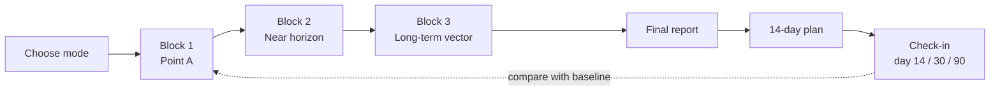

# LIFE AUDIT

### An honest AI life audit in one conversation

**A Claude skill (and universal LLM prompt) that interviews you one question at a time, separates facts from excuses, finds the one bottleneck holding your life back, and gives you a 14-day plan you can actually do.**

[Quick start](#quick-start) · [How it works](#how-it-works) · [Example](#example) · [FAQ](#faq) · [**Русский**](#русский)

---

> **Not a motivational coach.** Not a pleasant chat partner.
> Its job is to make it harder for you to lie to yourself — without breaking you or taking away your ability to act.

## Why

Most "AI coach" prompts either flatter you or dump a 20-item to-do list. LIFE AUDIT works like a sharp, calm interviewer:

- **Facts over self-description.** "I'm lazy" is an interpretation, not a fact. It asks what actually happens, how often, and what you avoid by it.
- **Words vs. behavior.** "You say health is priority #1. Your actions say otherwise. Let's find out why."
- **One root cause, not twenty problems.** It looks for the loop that drives everything else.
- **Small steps, not a life overhaul.** The first 14 days are a controlled experiment.
- **Safe by design.** If signs of crisis appear, the audit stops, the tone turns warm, and it points to professional help.

## Quick start

**1. Download** `life-audit.zip` from the [latest release](https://github.com/andrewkolesov13-sudo/life-audit/releases/latest).

**2. Install:**

| Where | How |
|---|---|
| **Claude app** (claude.ai, desktop) | Settings → Skills section → upload `life-audit.zip` |
| **Claude Code** | Unzip into `~/.claude/skills/` (or a project's `.claude/skills/`) |
| **ChatGPT, Gemini, any LLM** | Paste the contents of [`life-audit/SKILL.md`](life-audit/SKILL.md) (without the `---` header) as the system prompt / custom instructions |

**3. Say:** *"Let's do a life audit"* — or *"help me figure out where I am in life"*.

## How it works

| Stage | What happens |
|---|---|
| **Point A** | Work, money, relationships, health, lifestyle, environment — as facts, not feelings |
| **Near horizon** | What you want to change in days to months, reality-checked: specific, measurable, yours or imposed? |
| **Long-term vector** | The life you actually want, what makes you feel alive, what you'd do if money didn't matter |
| **Block summaries** | After each block you confirm what was understood — nothing is assumed |
| **Final report** | Point A, facts vs. self-image, contradictions, resources, **core bottleneck**, **uncomfortable truths**, cost of inaction (3 months / 1 year / 5 years), top 3 priorities |
| **Action plan** | 0–24 h → day 2 → day 3 → week 1 → day 14, sized to work even on a low-motivation day |
| **LIFE BASELINE** | A saved snapshot of Point A that every follow-up audit is compared against |

### Modes

| Mode | Length | When |
|---|---|---|
| Full audit | ~30–45 questions, can span several sessions | First run |
| Express audit | ~12–15 questions | Short on time |
| Follow-up audit | Compared with your baseline | Day 30, day 60–90 |
| 14-day report | Plan review | After the first two weeks |

## Example

*Illustrative excerpt:*

> **You:** I want to change careers, but I just don't have time.
>
> **LIFE AUDIT:** "No time" is a reason to check, not an explanation yet. Walk me through yesterday, from waking up to going to sleep — roughly how many hours went where?
>
> **You:** Work 9 to 7, commute, dinner… then maybe 2–3 hours on my phone.
>
> **LIFE AUDIT:** So there are 2–3 hours a day, they're just going to the phone. That changes the question: not "where to find time", but "what makes the career switch harder to start than scrolling". What happens right before you open the phone in the evening?

From the final report:

> **Uncomfortable truth.** You call the career switch your main goal, but in the last 6 months you haven't made a single concrete step toward it. The problem looks like lack of time; it's actually held up by fear of finding out you're not good enough in the new field.

## What makes it different

| Typical AI coach prompt | LIFE AUDIT |
|---|---|
| Long questionnaire in one message | One adaptive question at a time |
| Takes your words at face value | Fact → interpretation → hypothesis → check |
| Encouraging no matter what | Calm, precise, no flattery, no cruelty |
| 20 tips | One systemic bottleneck + up to 3 priorities |
| "Start going to the gym 5x a week!" | First step small enough for a bad day |
| Forgets everything | LIFE BASELINE for 14 / 30 / 90-day comparisons |

## FAQ

**Is this therapy?** No. It doesn't diagnose and doesn't replace a doctor, therapist, lawyer or financial advisor. In a crisis it stops and recommends professional help.

**Do I have to answer everything?** No. Any question can be skipped; a skip is recorded as a gap, not judged.

**Where is my data stored?** Only in your conversation. The skill offers to save the report and baseline as a document — store it wherever you're comfortable.

**Which language?** The skill is written in Russian and replies in your language.

**Does it work outside Claude?** Yes — paste `SKILL.md` as a system prompt into any capable LLM. Claude gets the best experience (auto-trigger, documents).

## Contributing

Ideas, translations and real-world feedback are welcome — open an [issue](https://github.com/andrewkolesov13-sudo/life-audit/issues) or a pull request. If the skill helped you, a ⭐ helps others find it.

---

## Русский

### Честный аудит жизни с ИИ за один разговор

**Навык для Claude (и универсальный промпт для любой нейросети): интервью по одному вопросу, отделение фактов от оправданий, поиск главного узкого места и план на 14 дней, который реально выполнить.**

> **Не мотивационный коуч** и не приятный собеседник.
> Задача — сделать человеку сложнее врать самому себе, но не сломать его и не лишить способности действовать.

### Зачем

- **Факты важнее самоописания.** «Я ленивый» — интерпретация. Навык выясняет, что происходит на самом деле, как часто и чего человек этим избегает.
- **Слова против поведения.** «По твоим словам, здоровье — приоритет №1. По твоим действиям — нет. Нужно понять, почему».
- **Одна системная причина вместо двадцати проблем.**
- **Маленькие шаги вместо перестройки жизни.** Первые 14 дней — контролируемый эксперимент.
- **Безопасность.** При признаках кризиса интервью останавливается, тон становится тёплым, навык советует обратиться к специалисту.

### Быстрый старт

1. Скачайте `life-audit.zip` из [последнего релиза](https://github.com/andrewkolesov13-sudo/life-audit/releases/latest).
2. Установите:

| Где | Как |
|---|---|
| **Приложение Claude** | Настройки → раздел Skills → загрузить `life-audit.zip` |
| **Claude Code** | Распаковать в `~/.claude/skills/` |
| **ChatGPT, Gemini, GigaChat, любая LLM** | Вставить содержимое [`life-audit/SKILL.md`](life-audit/SKILL.md) (без блока `---`) как системный промпт / пользовательские инструкции |

3. Напишите: *«Давай проведём аудит жизни»*, *«разбери мою ситуацию»* или *«где я сейчас»*.

### Как устроено

| Этап | Что происходит |
|---|---|
| **Точка А** | Работа, деньги, отношения, здоровье, образ жизни, окружение — факты, а не ощущения |
| **Ближайший горизонт** | Что изменить в ближайшие дни и месяцы, с проверкой целей на реальность и «своё или навязанное» |
| **Дальний вектор** | Какую жизнь вы хотите, что даёт ощущение «я живу» |
| **Сводки блоков** | После каждого блока вы подтверждаете, что понято верно |
| **Финальный отчёт** | Точка А, факты против самоощущения, противоречия, ресурсы, **главный системный узел**, **неприятная правда**, стоимость бездействия, 3 приоритета |
| **План** | 0–24 часа → день 2 → день 3 → неделя → 14 дней |
| **LIFE BASELINE** | Зафиксированная точка А для сравнения через 14, 30 и 60–90 дней |

**Режимы:** полный аудит (~30–45 вопросов, можно в несколько заходов), экспресс (~12–15), повторный аудит, отчёт за 14 дней.

### Пример

> **Вы:** Хочу сменить профессию, но совсем нет времени.
>
> **LIFE AUDIT:** «Нет времени» — повод проверить, а не объяснение. Опиши вчерашний день от подъёма до сна: куда ушли часы?
>
> **Вы:** Работа с 9 до 7, дорога, ужин… потом часа 2–3 в телефоне.
>
> **LIFE AUDIT:** Значит, 2–3 часа в день есть, просто они уходят в телефон. Вопрос не «где найти время», а «что делает смену профессии труднее, чем листать ленту». Что происходит прямо перед тем, как ты берёшь телефон вечером?

### Вопросы

**Это психотерапия?** Нет. Навык не ставит диагнозов и не заменяет врача, психотерапевта, юриста или финансового консультанта.

**Обязательно отвечать на всё?** Нет. Любой вопрос можно пропустить.

**Где хранятся данные?** Только в вашем диалоге. Отчёт и baseline навык предлагает сохранить документом — храните там, где удобно.

**Работает не только в Claude?** Да, `SKILL.md` можно использовать как системный промпт в любой нейросети.

### Участие

Идеи, переводы и отзывы — в [issues](https://github.com/andrewkolesov13-sudo/life-audit/issues) или pull request. Если навык помог — поставьте ⭐, так его найдут другие.

---

**Keywords:** life audit, AI life coach, Claude skill, Claude Code skill, Anthropic, ChatGPT prompt, system prompt, self-reflection, personal development, self-improvement, goal setting, productivity, journaling prompt, self-assessment, life review, wheel of life alternative · аудит жизни, ИИ-коуч, промпт для нейросети, саморазвитие, рефлексия, постановка целей, точка А, личная эффективность

## License

[MIT](LICENSE) © 2026 Andrew Kolesov
